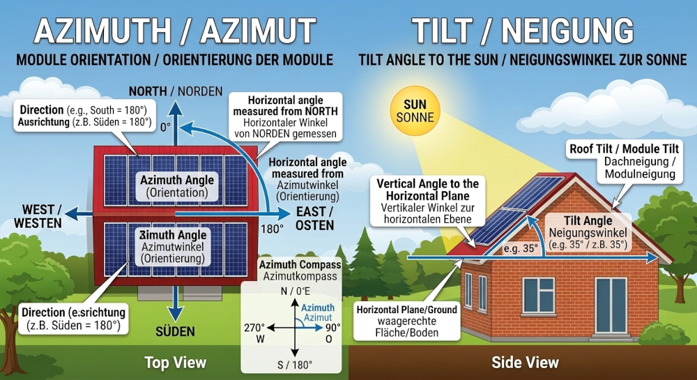

# ioBroker.open-meteo-pv-forecast

**Tests:** 

## open-meteo-pv-forecast adapter for ioBroker

**This adapter provides photovoltaic yield forecasts based on weather data from Open-Meteo.**

Unlike standard weather adapters, this adapter calculates solar irradiance specifically for tilted and oriented solar surfaces (Global Tilted Irradiance).

---

## Key Features

* **Multiple Locations:** Support for multiple PV systems/locations, e.g., for East/West orientations.
* **Hourly Forecast:** Detailed prediction of power output, temperature, cloud cover, and sunshine duration.
* **Daily Forecast:** Summary of expected energy (Wh) for up to 14 days.
* **15-Minutes Forecast:** 15-Minutely forecast for current day, 24 hours.
* **Physical Simulation:**
    * **Tilt & Azimuth:** Irradiance calculation based on panel orientation.
    * **PV Module Temperature:** Estimation of cell temperature considering ambient temperature, radiation intensity, and wind speed (Faiman model).
    * **Sunshine Duration:** Conversion of sunshine duration into minutes per hour.
* **Aggregation:** Automatic summing of all locations (total forecast) on both a daily, hourly and 15-minutely basis.
* **System Integration:** Automatic acquisition of location coordinates from the ioBroker system configuration if not manually set.
* **PV Module Temperature:** Estimated PV Module Temperature, based on Faiman model.

---

## Data Points (Objects)

For each configured location, a channel is created with the following data points:

### 15 Minutely Forecast (`15-min-forecast.0 - 95`), (24 Hours of current day), if enebled
| Data Point | Unit | Description |
|:---|:---|:---|
| `global_tilted_irradiance` | Wh | Expected energy based on installed capacity (kWp). |
| `pv_temperature` | °C | Estimated PV module temperature (Faiman calculation). |
| `temperature_2m` | °C | Air temperature at 2 meters height. |
| `cloud_cover` | % | Total cloud cover in percent. |
| `sunshine_duration` | min | Actual sunshine minutes within this hour. |
| `time` | - | Forecast time (HH:mm). |
| `wind_speed_10m` | km/h | Wind speed at 10 meters height. |

### Daily Forecast (`daily-forecast.dayX`)
| Data Point | Unit | Description |
|:---|:---|:---|
| `Date` | - | Forecast date (DD.MM.YYYY). |
| `Peak_day` | Wh | Expected total daily yield. |

### Hourly Forecast (`hourly-forecast.hourX`)
| Data Point | Unit | Description |
|:---|:---|:---|
| `time` | - | Forecast time (HH:mm). |
| `global_tilted_irradiance` | Wh | Expected energy based on installed capacity (kWp). |
| `pv_temperature` | °C | Estimated PV module temperature (Faiman calculation). |
| `temperature_2m` | °C | Air temperature at 2 meters height. |
| `cloud_cover` | % | Total cloud cover in percent. |
| `sunshine_duration` | min | Actual sunshine minutes within this hour. |
| `wind_speed_10m` | km/h | Wind speed at 10 meters height. |

### sum_peak_locations_15_Minutly (`0-95`) if enebled
| Data Point | Unit | Description |
|:---|:---|:---|
| `sum_locations` | Wh | Sum of Locations 15 Minutely |
| `time` | - | Forecast time (HH:mm). |

### sum_peak_locations_Daily (`dayX`) if enebled
| Data Point | Unit | Description |
|:---|:---|:---|
| `sum_locations` | Wh | Sum of Locations Daily |

### sum_peak_locations_Hourly (`HourX`) if enebled
| Data Point | Unit | Description |
|:---|:---|:---|
| `sum_locations` | Wh | Sum of Locations Hourly |
| `time` | - | Forecast time (HH:mm). |

---

## Configuration

### Basic Settings
* **Forecast Hours:** Timeframe for the hourly view (3 to 48 hours).
* **Forecast Days:** Duration of the daily forecast (3 to 14 days).
* **Update Interval:** Frequency of data updates (15, 30, or 60 minutes or disabled). If disabled, you can use a custom cron schedule to trigger the instance.

### Datapoints Settings
* **Rolling Hours or Fixed Hours:** If 'Rolling Hours' is selected, the hourly forecast will always show the next hours starting from the current hour. If 'Fixed Hours' is selected, the hourly forecast will show fixed time intervals (e.g., 00:00-23:00) regardless of the current time.
* **15-minutes Forecast:** If enabled, additional states will be created for a 15-minute forecast (up to 24 hours for the current day). Please note that 15-minute data availability depends on the Open-Meteo API and may vary by location or time.

### Locations (Table)
The following values must be defined for each location:
1.  **Name:** Unique identifier (sanitized for the object ID).
2.  **Latitude/Longitude:** GPS position (optional: uses system values otherwise).
3.  **Tilt:** Angle of the modules (0° = flat, 90° = vertical).
4.  **Azimuth:** Orientation (-180° to 180°, 0° = South, -90° = East, 90° = West).
5.  **Power (kWp):** Installed peak capacity of the system.
6.  **Timezone:** Selection of the local timezone (Default: Auto).

### Global Options, only visible if you have multible Locations!
* **Total Sum (Daily):** Creates the channel `sum_peak_locations_Daily`, summing the yields of all systems.
* **Total Sum (Hourly):** Creates the channel `sum_peak_locations_Hourly` for the total hourly performance.
* **Total Sum (15-Minutely):** Creates the channel `sum_peak_locations_15_Minutely` for the total 15 Minutes forecast.

---

## Technical Details & Calculation

### PV Temperature Model
The adapter uses the **Faiman model** to estimate the module temperature. This model accounts for wind cooling, which directly impacts efficiency:
`pvTemp = Ambient Temperature + Irradiance / (25 + 6.84 * Wind Speed)`.

### Data Cleanup
Upon restart or configuration changes, the adapter automatically removes stale data points if locations are deleted or summation functions are deactivated.

---

## Changelog
### **WORK IN PROGRESS**
* (H5N1v2) Added checkboxes in instance settings for daily, hourly and 15-minutely totals (only visible if multiple locations are configured).
* (H5N1v2) Added hourlyUpdate configuration for rolling vs. fixed hour selection.
* (H5N1v2) Added 15-minute high-resolution forecast data (96 intervals per day).
* (H5N1v2) Added automated sum calculations for 15-minute intervals across all locations.
* (H5N1v2) Improved updateInterval logic to allow manual/cron execution when set to 0 (Disabled).
* (H5N1v2) Added a new datapoint `pv_temperature` to the hourly location forecast, based on the Faiman model.

### 0.3.0-alpha.0 (2026-03-06)
* (H5N1v2) Added total peak of all locations
* (H5N1v2) Added a checkbox for generating a total sum in the settings.
* (H5N1v2) fix: language used for stateIds and names
* (H5N1v2) fix: creation of intermediate objects missing
* (H5N1v2) chore: update dependencies to latest versions
* (H5N1v2) added axios in dependencies

### 0.2.0-alpha.0 (2026-02-19)
* (H5N1v2) Added temperature_2m, cloud_cover, wind_speed_10m, sunshine_duration to hourly forecast.
* (H5N1v2) feat: Leave latitude and longitude empty to use system coordinates.
* (H5N1v2) Added URL debug output for API calls.
* (H5N1v2) Update dev dependencies.

### 0.1.1-alpha.0 (2026-02-15)
* (H5N1v2) Fix: Daily peak was incorrect, it only recorded the period from the current hour until the end of the day.

### 0.1.0-alpha.0 (2026-02-13)
* (H5N1v2) feat: add forecastDays for Sum
* (H5N1v2) Modified the fetching logic to retrieve enough hourly data to cover both hourly and daily forecasts.
* (H5N1v2) Implemented a new method to calculate and update daily forecast data based on hourly data.
* (H5N1v2) Adjusted the time format for hourly forecast states to display only HH:mm.

### 0.0.1-alpha.0 (2026-02-13)
* (H5N1v2) initial release

## License
MIT License

Copyright (c) 2026 H5N1v2 <h5n1@iknox.de>

Permission is hereby granted, free of charge, to any person obtaining a copy
of this software and associated documentation files (the "Software"), to deal
in the Software without restriction, including without limitation the rights
to use, copy, modify, merge, publish, distribute, sublicense, and/or sell
copies of the Software, and to permit persons to whom the Software is
furnished to do so, subject to the following conditions:

The above copyright notice and this permission notice shall be included in all
copies or substantial portions of the Software.

THE SOFTWARE IS PROVIDED "AS IS", WITHOUT WARRANTY OF ANY KIND, EXPRESS OR
IMPLIED, INCLUDING BUT NOT LIMITED TO THE WARRANTIES OF MERCHANTABILITY,
FITNESS FOR A PARTICULAR PURPOSE AND NONINFRINGEMENT. IN NO EVENT SHALL THE
AUTHORS OR COPYRIGHT HOLDERS BE LIABLE FOR ANY CLAIM, DAMAGES OR OTHER
LIABILITY, WHETHER IN AN ACTION OF CONTRACT, TORT OR OTHERWISE, ARISING FROM,
OUT OF OR IN CONNECTION WITH THE SOFTWARE OR THE USE OR OTHER DEALINGS IN THE
SOFTWARE.